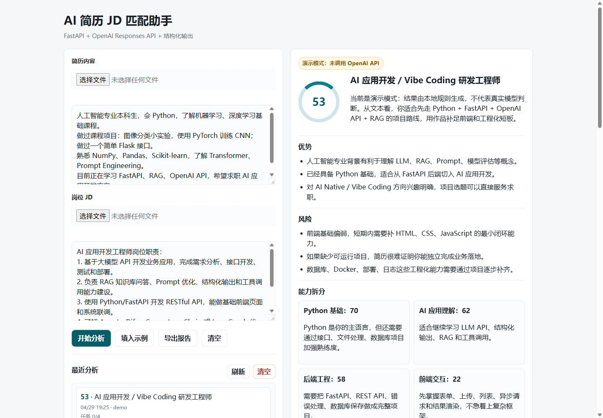

# AI Resume JD Matcher

[](https://github.com/daoxianpiao/ai-resume-jd-matcher/actions/workflows/ci.yml)

一个面向 AI Native 应用开发求职场景的简历/JD 匹配工具。用户输入简历和岗位 JD 后，系统会生成结构化匹配分析，包括匹配分数、能力拆分、缺失关键词、学习计划、项目建议、面试表达要点，并自动保存历史记录和学习任务。

项目支持无 API Key 的本地演示模式，也支持配置 OpenAI API Key 后调用真实模型。

## 界面预览



## 项目价值

这个项目不是单纯的聊天机器人，而是一个完整的小型 AI Web 应用：

- 用 FastAPI 把 AI 能力封装成可调试的 Web API
- 用 Pydantic 约束结构化输出，方便前端稳定渲染
- 用 SQLite 保存分析历史和学习任务状态
- 用普通 HTML/CSS/JavaScript 完成前后端联调
- 用 Docker Compose 实现可复现运行
- 用 pytest + GitHub Actions 覆盖核心接口测试

## 功能

- 简历与岗位 JD 匹配分析
- 本地演示模式，无 OpenAI API Key 也能运行
- OpenAI Responses API 结构化输出
- `.txt`、`.md`、`.pdf`、`.docx` 文件文本解析
- 匹配度评分、优势、风险、关键词缺口和能力拆分
- 30 天学习计划生成
- 学习任务看板，支持勾选完成并持久化
- 分析历史保存、查看、删除和清空
- Markdown 求职报告导出
- Swagger API 文档
- Docker 容器化运行
- 自动化接口测试和 GitHub Actions CI

## 技术栈

- 后端：FastAPI、Pydantic、OpenAI Python SDK
- 数据库：SQLite
- 前端：HTML、CSS、JavaScript、Fetch API
- 文件解析：pypdf、python-docx
- 测试：pytest、FastAPI TestClient
- 部署：Dockerfile、Docker Compose
- CI：GitHub Actions

## 项目结构

```text
.
├── main.py                  # FastAPI 后端、AI 分析、数据库逻辑
├── templates/
│   └── index.html           # 前端页面
├── tests/
│   └── test_api.py          # 接口测试
├── data/                    # SQLite 数据目录，本地运行时生成，不提交 Git
├── Dockerfile               # 应用镜像构建
├── compose.yaml             # Docker Compose 运行配置
├── requirements.txt         # 生产依赖
├── requirements-dev.txt     # 开发和测试依赖
└── README.md
```

## 快速开始

### 本地运行

```powershell
python -m venv .venv
.\.venv\Scripts\Activate.ps1
pip install -r requirements.txt
Copy-Item .env.example .env
uvicorn main:app --reload
```

打开：

```text
http://127.0.0.1:8000
```

如果 `.env` 里没有真实 `OPENAI_API_KEY`，项目会自动使用本地演示模式。

### Docker 运行

```powershell
docker compose up --build
```

打开：

```text
http://127.0.0.1:8001
```

停止服务：

```powershell
docker compose down
```

## API 文档

启动项目后打开：

```text
http://127.0.0.1:8001/docs
```

核心接口：

- `POST /api/analyze`：提交简历和 JD，生成匹配分析
- `POST /api/extract-file`：上传文件并解析文本
- `GET /api/history`：读取历史记录
- `GET /api/history/{analysis_id}`：读取某次分析详情
- `PATCH /api/learning-tasks/{task_id}`：更新学习任务完成状态
- `DELETE /api/learning-tasks/{task_id}`：删除学习任务
- `GET /health`：健康检查

## 运行测试

```powershell
pip install -r requirements-dev.txt
pytest -q
```

当前测试覆盖：

- 健康检查
- 简历分析
- 历史记录创建与读取
- 学习任务状态更新
- 文件解析
- 非法文件类型拦截

## 数据持久化

项目使用 SQLite 保存数据。Docker Compose 中配置了卷挂载：

```yaml
volumes:
  - ./data:/app/data
```

因此容器重建后，`data/app.db` 中的历史记录和学习任务仍会保留。

## 简历描述参考

基于 FastAPI + OpenAI Responses API 开发 AI 简历 JD 匹配助手，支持简历与岗位 JD 文本分析、文件解析、匹配度评分、能力短板识别、学习任务追踪、Markdown 报告导出和历史记录管理。项目使用 Pydantic 定义结构化输出，并通过 SQLite 实现分析历史和学习任务的新增、查询、更新、删除；使用 Docker Compose 完成容器化部署，并通过 pytest 与 GitHub Actions 覆盖核心接口测试。

## 后续计划

- 增加 RAG 知识库问答项目模块
- 增加真实模型调用错误重试和日志记录
- 增加用户配置页
- 增加页面截图和在线部署地址
